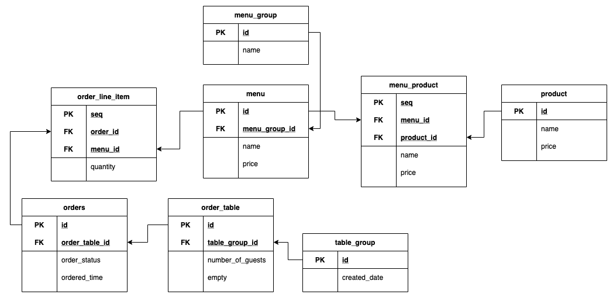

# 키친포스

## 요구 사항

### 상품

- [x] 상품을 등록할 수 있다.
  - [x] 상품명은 1자 이상이어야한다. 
  - [x] 상품의 가격은 0원 이상이어야한다.
- [x] 상품을 조회할 수 있다.

### 메뉴

- [x] 메뉴를 등록할 수 있다.
  - [x] 메뉴 이름은 1자 이상의 문자로 구성되어야한다.
  - [x] 메뉴의 가격은 0원 이상이어야한다.
  - [x] 메뉴 제품을 등록할 수 있다.
    - [x] 메뉴 제품 번호와 양을 등록한다.
    - [x] 메뉴 제품 번호는 0 이상이어야한다.
    - [x] 메뉴 제품 양은 0 이상이어야한다.
- [x] 메뉴를 조회할 수 있다.

### 메뉴 그룹

- [x] 메뉴 분류를 위한 그룹을 등록할 수 있다.
- [x] 메뉴 분류를 위한 그룹을 조회할 수 있다.

### 테이블

- [x] 테이블을 등록할 수 있다.
  - 테이블의 손님 인원은 0이상 이어야한다.
  - 테이블 공석 유무를 등록해야한다.
- [x] 전체 테이블들을 조회한다.
- [x] 테이블의 공석 유무를 변경한다.
  - [x] 공석 유무는 true/false를 반환해야한다.
  - [x] 단체 손님인 경우 변경할 수 없다.
  - [x] 조리/식사중인 경우 변경할 수 없다.
- [x] 테이블의 손님 인원을 변경한다.
  - [x] 테이블의 손님 인원은 0이상이어야한다.
  - [x] 테이블이 공석인 경우 변경할 수 없다.

- [x] 주문 테이블 그룹을 등록한다.
  - [x] 테이블 번호는 0 이상이어야한다.
  - [x] 테이블 번호는 현재 존재하지 않는 번호여야한다.
  - [x] 테이블 번호 개수는 2 이상이어야한다. 
- [x] 주문받을 테이블을 제거한다.
  - [x] 테이블 번호는 0 이상이어야한다.
  - [x] 그룹을 삭제할 테이블의 번호는 존재해야한다.
  - [x] 테이블의 상태가 조리중/식사중인 경우 제거할 수 없다.

### 주문

- [x] 메뉴를 주문할 수 있다.
  - 주문할 테이블 아이디는 0 이상이어야한다.
  - 주문 항목 개수는 1 이상이어야한다.
  - 주문할 메뉴 번호는 0 이상이어야한다.
  - 주문할 메뉴의 개수는 1 이상이어야한다.
- [x] 주문 내역을 조회할 수 있다.
- [x] 주문 상태를 조회할 수 있다.
  - 주문 상태는 조리, 식사, 계산 완료 중 하나여야한다.
- [x] 주문 상태를 변경할 수 있다.
  

---

## 용어 사전

| 한글명 | 영문명 | 설명 |
| --- | --- | --- |
| 상품 | product | 메뉴를 관리하는 기준이 되는 데이터 |
| 메뉴 그룹 | menu group | 메뉴 묶음, 분류 |
| 메뉴 | menu | 메뉴 그룹에 속하는 실제 주문 가능 단위 |
| 메뉴 상품 | menu product | 메뉴에 속하는 수량이 있는 상품 |
| 금액 | amount | 가격 * 수량 |
| 주문 테이블 | order table | 매장에서 주문이 발생하는 영역 |
| 빈 테이블 | empty table | 주문을 등록할 수 없는 주문 테이블 |
| 주문 | order | 매장에서 발생하는 주문 |
| 주문 상태 | order status | 주문은 조리 ➜ 식사 ➜ 계산 완료 순서로 진행된다. |
| 방문한 손님 수 | number of guests | 필수 사항은 아니며 주문은 0명으로 등록할 수 있다. |
| 단체 지정 | table group | 통합 계산을 위해 개별 주문 테이블을 그룹화하는 기능 |
| 주문 항목 | order line item | 주문에 속하는 수량이 있는 메뉴 |
| 매장 식사 | eat in | 포장하지 않고 매장에서 식사하는 것 |
  

---

## Diagram

