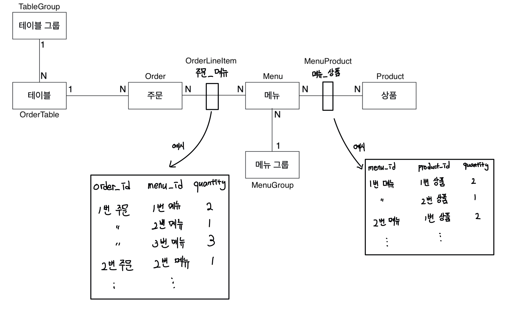

# 키친포스

## 도메인 구조

## 요구 사항

 

### 메뉴 그룹(Menu Group)

* 메뉴 그룹을 생성(등록)할 수 있다. - `POST /api/menu-groups`
* 전체 메뉴 그룹을 조회할 수 있다. - `GET /api/menu-groups`

 

# 메뉴(Menu)

* 메뉴를 생성(등록)할 수 있다. - `POST /api/menus`
    * 메뉴 가격 예외
        * 메뉴 가격은 0원 이상이어야 한다.
        * 메뉴에 속하는 모든 상품 가격의 합은 0원보다 커야한다.
    * 메뉴 그룹 예외
        * 메뉴 그룹에 속하지 않은 메뉴는 생성할 수 없다.
    * 메뉴에 속하는 상품 예외
        * 존재하지 않는 상품을 메뉴로 등록할 수 없다.
* 전체 메뉴를 조회할 수 있다. - `GET /api/menus`

 

### 주문(Order)

* 주문을 생성(등록)할 수 있다 - `POST /api/orders`
    * 주문이 생성되면 초기 상태는 `COOKING`이다.
    * 주문이 생성되면 주문 시간은 현재(`LocalDataTime.now()`)이다.
    * 주문 메뉴 예외
        * 메뉴 목록은 적어도 1개 이상이어야 한다.
        * 메뉴 목록에 포함된 메뉴들은 모두 등록되어 있어야 한다.
    * 주문 테이블 예외
        * 주문이 속하는 테이블은 존재해야 한다.
        * 주문이 속하는 테이블은 비어있으면 안된다.
* 전체 주문을 조회할 수 있다. -  `GET /api/orders`
* 주문 상태를 변경할 수 있다. -  `PUT /api/orders/{orderId}/order-status`
    * 주문 예외
        * 존재하지 않는 주문은 변경할 수 없다.
        * `COMPLETION`인 주문은 변경할 수 없다.

 

### 상품(Product)

* 상품을 생성(등록)할 수 있다. - `POST /api/products`
    * 상품 가격 예외
        * 상품 가격은 0보다 작을 수 없다.
* 전체 상품을 조회할 수 있다. - `GET /api/products`

 

### 테이블 그룹(TableGroup) - 단체

* 테이블 그룹을 생성(등록)할 수 있다. - `POST /api/table-groups`
    * 테이블 그룹이 생성되면 생성 시간은 현재(`LocalDateTime.now()`)이다.
    * 테이블 그룹에 속할 테이블들은 모두 비어 있지 않는 상태가 된다.
    * 테이블 그룹에 속할 테이블들의 그룹은 모두 생성되는 테이블을 가리킨다.
    * 테이블 예외
        * 테이블 그룹에 속할 테이블 수는 적어도 2개 이상이어야 한다.
        * 테이블 그룹에 속할 테이블은 모두 등록된 테이블이어야 한다.
        * 테이블 그룹에 속할 테이블들은 모두 비어있어야 한다.
        * 테이블 그룹에 속할 테이블들은 모두 이미 다른 그룹에 속해있으면 안된다.
* 테이블 그룹을 해제할 수 있다. - `DELETE /api/table-groups/{tableGroupId}`
    * 테이블 그룹이 해제된 테이블들은 모두 비어 있지 않은 상태가 된다.
    * 테이블 그룹이 해제된 테이블들의 그룹은 모두 어떤 테이블도 가리키지 않는다.
    * 테이블 상태 예외
        * 테이블 그룹에 속한 테이블의 주문 상태중 하나라도 `COOKING`이거나 `MEAL` 면 해제할 수 없다.

 

### 테이블(OrderTable)

* 테이블을 생성(등록)할 수 있다. - `POST /api/tables`
    * 생성된 테이블은 어떤 테이블 그룹도 가리키지 않는다.
* 전체 테이블을 조회할 수 있다. - `GET /api/tables`
* 특정 테이블을 빈 테이블로 변경할 수 있다. - `PUT /api/tables/{orderTableId}/empty`
    * 테이블 예외
        * 존재하지 않는 테이블을 빈 테이블로 변경할 수 없다.
        * 빈 상태로 변경하려는 테이블은 어떠한 테이블 그룹에도 속해 있으면 안된다.
    * 주문 예외
        * 테이블에 속한 주문의 상태가 `COOKING`이거나 `MEAL`이면 빈 상태로 변경할 수 없다.
* 특정 테이블의 인원 수를 변경할 수 있다. - `PUT /api/tables/{orderTableId}/number-of-guests`
    * 테이블 예외
        * 변경하려는 테이블의 인원 수는 0보다 작을 수 없다.
        * 변경하려는 테이블이 비어 있다면 인원 수를 변경할 수 없다.
        * 존재하지 않는 테이블의 인원 수를 변경할 수 없다.

 

## 용어 사전

| 한글명 | 영문명 | 설명 |
| --- | --- | --- |
| 상품 | product | 메뉴를 관리하는 기준이 되는 데이터 |
| 메뉴 그룹 | menu group | 메뉴 묶음, 분류 |
| 메뉴 | menu | 메뉴 그룹에 속하는 실제 주문 가능 단위 |
| 메뉴 상품 | menu product | 메뉴에 속하는 수량이 있는 상품 |
| 금액 | amount | 가격 * 수량 |
| 주문 테이블 | order table | 매장에서 주문이 발생하는 영역 |
| 빈 테이블 | empty table | 주문을 등록할 수 없는 주문 테이블 |
| 주문 | order | 매장에서 발생하는 주문 |
| 주문 상태 | order status | 주문은 조리 ➜ 식사 ➜ 계산 완료 순서로 진행된다. |
| 방문한 손님 수 | number of guests | 필수 사항은 아니며 주문은 0명으로 등록할 수 있다. |
| 단체 지정 | table group | 통합 계산을 위해 개별 주문 테이블을 그룹화하는 기능 |
| 주문 항목 | order line item | 주문에 속하는 수량이 있는 메뉴 |
| 매장 식사 | eat in | 포장하지 않고 매장에서 식사하는 것 |
