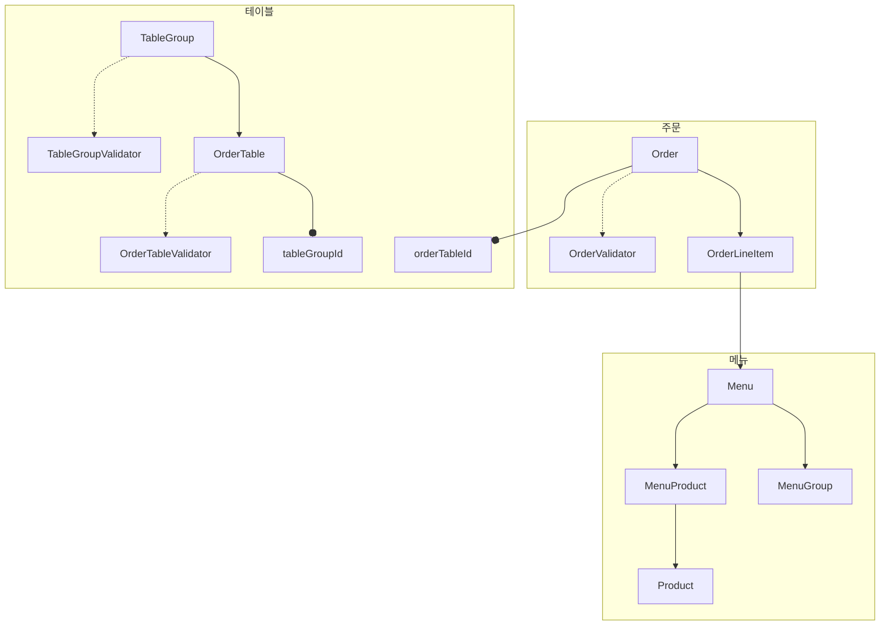

# 키친포스

식별자값도 객체로 가정하고 관계를 봤습니다.

## 요구 사항

## 상품 (Product)

### 상품 등록

- 상품을 등록한다.
- `EXCEPTION` 상품 가격은 null 이거나 음수일 수 없다.

### 상품 조회

- 모든 상품 목록을 조회한다.

   
   
   

## 메뉴 그룹 (MenuGroup)

### 메뉴 그룹 등록

- 메뉴 그룹을 등록한다.

### 메뉴 그룹 조회

- 전체 메뉴 그룹 목록을 조회한다.

   
   
   

## 메뉴 (Menu)

### 메뉴 등록

#### 메뉴 가격

- `EXCEPTION` 메뉴는 메뉴 상품 목록의 가격 총합보다 가격이 적어야 한다.
- `EXCEPTION` 메뉴는 가격이 음이 아닌 정수로 존재해야 한다.

#### 메뉴 그룹

- `EXCEPTION` 메뉴는 속할 메뉴 그룹이 존재해야 한다.

#### 메뉴 상품

- 메뉴는 등록할 메뉴 상품이 비어있을 수 있다.

   
   
   

## 주문 (Order)
### 주문 등록

- 주문시 주문 상태는 COOKING 이어야 한다.
- `EXCEPTION` 주문 항목 목록이 비어있는 경우 주문할 수 없다.
- `EXCEPTION` 주문 항목 목록 수량이 메뉴에서 찾을 수 있는 메뉴의 수량과 다를 경우 주문할 수 없다.
- `EXCEPTION` 주문 테이블이 존재하지 않을 경우 주문할 수 없다.

### 주문 수정

- `EXCEPTION` 주문이 존재하지 않을 경우 주문 상태를 변경할 수 없다.
- `EXCEPTION` 주문이 완료 상태인 경우 주문 상태를 변경할 수 없다.

   
   
   

## 주문 테이블 (OrderTable)

### 주문 테이블 등록

- 주문 테이블을 등록한다.

### 주문 테이블 조회

- 전체 주문 테이블을 조회한다.

### 주문 테이블 수정

- 주문 테이블의 빈 상태를 변경한다.
  - `EXCEPTION` 단체 지정이 등록되어 있을 경우 상태를 변경할 수 없다.
  - `EXCEPTION` 음식이 준비 중이거나 식사 중일 경우 상태를 변경할 수 없다.
  - 주문이 없어도 주문 테이블 빈 상태를 변경할 수 있다.

- 주문 테이블의 손님 수를 변경한다.
  - `EXCEPTION` 손님 수가 0 미만일 수 없다.
  - `EXCEPTION` 주문 테이블이 비어있는 상태일 경우 손님 수를 변경할 수 없다.

   
   
   

## 단체 지정(TableGroup)

### 단체 지정 등록

- `EXCEPTION` 주문 테이블 수가 2 미만일 경우 단체 지정으로 등록할 수 없다.
- `EXCEPTION` 주문 테이블이 비어있지 않은 상태여도 단체 지정이 할당되어 있으면 새로운 단체 지정으로 등록할 수 없다.
- `EXCEPTION` 주문 테이블 수가 실제 테이블 수와 같지 않은 경우 단체 지정으로 등록할 수 없다.

### 단제 지정 해제

- `EXCEPTION` 단체 지정된 주문 테이블 목록의 각 주문이 단 하나라도 COMPLETION 상태가 아니라면 단체 지정을 해제할 수 없다.

   
   
   

## 용어 사전

| 한글명 | 영문명 | 설명 |  
| --- | --- | --- |  
| 상품 | product | 메뉴를 관리하는 기준이 되는 데이터 |  
| 메뉴 그룹 | menu group | 메뉴 묶음, 분류 |  
| 메뉴 | menu | 메뉴 그룹에 속하는 실제 주문 가능 단위 |  
| 메뉴 상품 | menu product | 메뉴에 속하는 수량이 있는 상품 |  
| 금액 | amount | 가격 * 수량 |  
| 주문 테이블 | order table | 매장에서 주문이 발생하는 영역 |  
| 빈 테이블 | empty table | 주문을 등록할 수 없는 주문 테이블 |  
| 주문 | order | 매장에서 발생하는 주문 |  
| 주문 상태 | order status | 주문은 조리 ➜ 식사 ➜ 계산 완료 순서로 진행된다. |  
| 방문한 손님 수 | number of guests | 필수 사항은 아니며 주문은 0명으로 등록할 수 있다. |  
| 단체 지정 | table group | 통합 계산을 위해 개별 주문 테이블을 그룹화하는 기능 |  
| 주문 항목 | order line item | 주문에 속하는 수량이 있는 메뉴 |  
| 매장 식사 | eat in | 포장하지 않고 매장에서 식사하는 것 |
