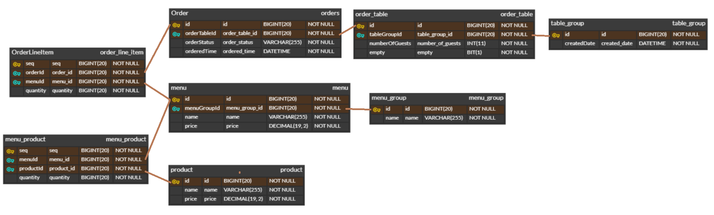

# 키친포스

> 레거시 리팩터링 미션 요구사항은 [이 문서](./docs/mission_requirements.md)에서 볼 수 있습니다.

## 요구 사항

### 메뉴 그룹 - menu group

- 메뉴 그룹 생성
    - 이름은 null이 될 수 없다.
    - 메뉴 그룹 정보를 반환한다.
- 메뉴 그룹 목록 조회

### 메뉴 - menu

- 메뉴 생성
    - 가격은 null 또는 0 미만이 될 수 없다.
    - 메뉴 그룹이 존재하지 않으면 등록할 수 없다.
    - 메뉴에 속하는 상품의 합계가 0을 초과해야 한다.
        - 상품의 합계는 모든 상품의 `재고 수 * 상품 가격`을 합한 값이다.
    - 메뉴 가격은 상품의 합계보다 작거나 같아야 한다.
    - 메뉴 상품을 함께 저장한다.
    - 메뉴 정보를 반환한다.
- 메뉴 목록 조회
    - 메뉴 상품 목록과 함께 조회한다.

### 주문 - order

- 주문 생성
    - 주문 항목 목록이 1개 이상이어야 한다.
    - 주문 항목 목록에 존재하지 않는 메뉴가 포함되면 주문할 수 없다.
    - 유효하지 않은 주문 테이블은 주문할 수 없다.
    - 주문 항목을 함께 저장한다.
    - 주문 정보를 반환한다.
- 주문 목록 조회
    - 주문 항목 목록과 함께 조회한다.
- 주문 상태 변경
    - 존재하지 않는 주문의 정보를 변경할 수 없다.
    - 주문 상태가 `COMPLETION`이면 변경할 수 없다.
    - 주문과 주문 항목을 반환한다.

### 상품 - product

- 상품 생성
    - 가격은 null 또는 0 미만이 될 수 없다.
    - 상품 정보를 반환한다.
- 상품 목록 조회

### 단체 지정 - table group

- 단체 지정 생성
    - 주문 테이블은 2개 미만일 수 없다.
    - 존재하지 않는 주문 테이블은 단체 지정이 불가능하다.
    - 이미 단체 지정된 주문 테이블은 새로 단체 지정하는 것이 불가능하다.
    - 주문 테이블의 단체 지정 정보를 갱신한다.
    - 단체 지정 정보를 반환한다.
- 단체 지정 해제
    - 요리 중이거나 식사 중인 주문 테이블이 있으면 단체 지정을 해제할 수 없다.
    - 주문 테이블의 단체 지정 정보를 갱신한다.

### 테이블 - table

- 테이블 생성
- 테이블 목록 조회
- 빈 테이블의 상태 변경
    - 존재하는 주문 테이블이어야 한다.
    - 단체 지정이 되어있으면 안 된다.
    - 주문 테이블이 요리 중이거나 식사 중이면 안 된다.
    - 변경된 주문 테이블의 정보를 반환한다.
- 방문한 손님 수 변경
    - 손님 수는 0 미만이 될 수 없다.
    - 존재하지 않는 주문 테이블의 손님 수를 변경할 수 없다.
    - 주문 테이블은 비어있으면 안 된다.
    - 변경된 주문 테이블의 정보를 반환한다.

## 용어 사전

| 한글명 | 영문명 | 설명 |
| --- | --- | --- |
| 상품 | product | 메뉴를 관리하는 기준이 되는 데이터 |
| 메뉴 그룹 | menu group | 메뉴 묶음, 분류 |
| 메뉴 | menu | 메뉴 그룹에 속하는 실제 주문 가능 단위 |
| 메뉴 상품 | menu product | 메뉴에 속하는 수량이 있는 상품 |
| 금액 | amount | 가격 * 수량 |
| 주문 테이블 | order table | 매장에서 주문이 발생하는 영역 |
| 빈 테이블 | empty table | 주문을 등록할 수 없는 주문 테이블 |
| 주문 | order | 매장에서 발생하는 주문 |
| 주문 상태 | order status | 주문은 조리 ➜ 식사 ➜ 계산 완료 순서로 진행된다. |
| 방문한 손님 수 | number of guests | 필수 사항은 아니며 주문은 0명으로 등록할 수 있다. |
| 단체 지정 | table group | 통합 계산을 위해 개별 주문 테이블을 그룹화하는 기능 |
| 주문 항목 | order line item | 주문에 속하는 수량이 있는 메뉴 |
| 매장 식사 | eat in | 포장하지 않고 매장에서 식사하는 것 |

## DB 구조

