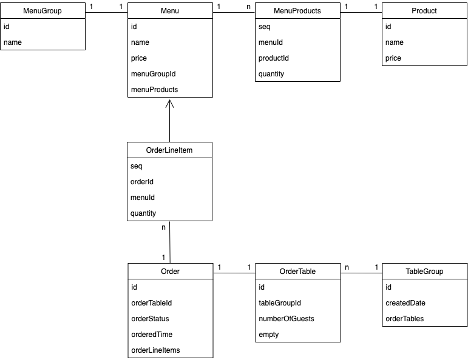

# 키친포스

## 용어 사전

| 한글명 | 영문명 | 설명 |
| --- | --- | --- |
| 상품 | product | 메뉴를 관리하는 기준이 되는 데이터 |
| 메뉴 그룹 | menu group | 메뉴 묶음, 분류 |
| 메뉴 | menu | 메뉴 그룹에 속하는 실제 주문 가능 단위 |
| 메뉴 상품 | menu product | 메뉴에 속하는 수량이 있는 상품 |
| 금액 | amount | 가격 * 수량 |
| 주문 테이블 | order table | 매장에서 주문이 발생하는 영역 |
| 빈 테이블 | empty table | 주문을 등록할 수 없는 주문 테이블 |
| 주문 | order | 매장에서 발생하는 주문 |
| 주문 상태 | order status | 주문은 조리 ➜ 식사 ➜ 계산 완료 순서로 진행된다. |
| 방문한 손님 수 | number of guests | 필수 사항은 아니며 주문은 0명으로 등록할 수 있다. |
| 단체 지정 | table group | 통합 계산을 위해 개별 주문 테이블을 그룹화하는 기능 |
| 주문 항목 | order line item | 주문에 속하는 수량이 있는 메뉴 |
| 매장 식사 | eat in | 포장하지 않고 매장에서 식사하는 것 |

## 클래스 다이어그램

## 요구 사항

### 메뉴

- [x] 메뉴를 등록할 수 있다.
    - [x] 메뉴의 가격은 0원 이상이어야 한다.
    - [x] 메뉴가 속한 메뉴그룹이 존재해야 한다.
- [x] 메뉴 목록을 조회할 수 있다.

### 메뉴 그룹

- [x] 메뉴 그룹을 등록할 수 있다.
- [x] 메뉴 그룹 목록을 조회할 수 있다.

### 주문

- [x] 주문을 등록할 수 있다.
    - [x] 주문 항목이 1개 이상 존재해야 한다.
    - [x] 주문 항목의 메뉴가 모두 존재해야 한다.
    - [x] 주문이 속한 주문 테이블이 존재해야 한다.
        - [x] 해당 테이블은 빈 테이블이 아니어야 한다.
- [x] 주문 목록을 조회할 수 있다.
- [x] 주문 상태를 변경할 수 있다.
    - [x] 주문 상태가 계산 완료가 아니어야 한다.

### 상품

- [x] 상품을 등록할 수 있다.
    - [x] 상품의 가격은 0원 이상이어야 한다.
- [x] 상품 목록을 조회할 수 있다.

### 단체 지정

- [x] 단체로 지정할 수 있다.
    - [x] 주문 테이블이 2개 이상이어야 한다.
    - [x] 주문 테이블이 모두 존재해야 한다.
    - [x] 주문 테이블이 빈 테이블이어야 한다.
- [x] 단체 지정을 해제할 수 있다.
    - [x] 주문 상태는 조리, 식사가 아니어야 한다.
 
### 주문 테이블

- [ ] 주문 테이블을 생성할 수 있다.
- [ ] 주문 테이블의 목록을 조회할 수 있다.
- [ ] 주문 테이블을 빈 테이블로 만들 수 있다.
    - [ ] 기존에 존재하는 테이블이어야 한다.
    - [ ] 주문 상태는 조리, 식사가 아니어야 한다.
- [ ] 주문 테이블의 방문한 손님 수를 변경할 수 있다.
    - [ ] 방문한 손님 수는 0명 이상이어야 한다.
    - [ ] 해당 테이블은 빈 테이블이 아니어야 한다.