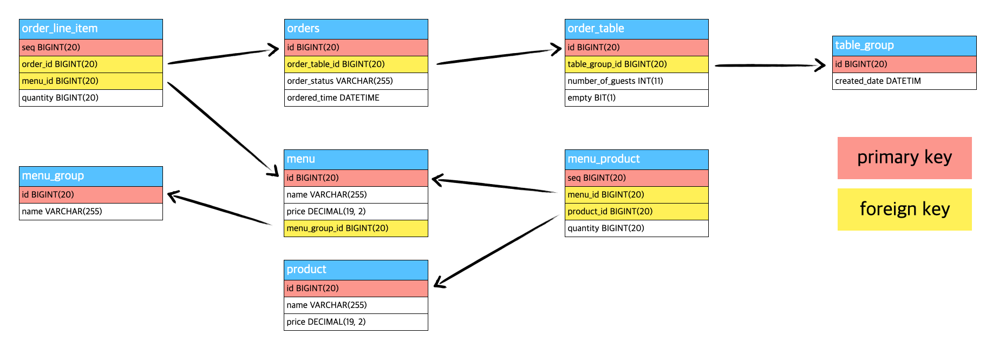

# 키친포스

## 요구 사항

### 테이블 구조 파악하기

### Product

메뉴 관리에 기준이 되는 product이다. product의 name과 price를 가지고 있다.

### MenuGroup 

menuGroup은 menu의 묶음을 나타낸다.

### Menu

menu는 menuGroup에 속한 실제 주문 가능한 단위를 나타낸다. name, price, menuGroupId, MenuProducts를 가지고 있다.

### MenuProduct

MenuProduct는 메뉴에 속하는 수량이 있는 product를 나타낸다. menuId, productId, quantity를 가지고 있다.

### TableGroup

TableGroup은 통합 계산을 위해 개별 주문 테이블을 그룹화하기 위한 용도이다. createdDate, orderTables를 가지고 있다.
TableGroup이 생성되면 그룹 내부에 존재하는 orderTable은 모두 비어있지 않은 상태로 변경된다.

### OrderTable

OrderTable은 매장에서 주문이 발생하는 영역이다.
tableGroupId, numberOfGuests, empty를 가지고 있다. 
numberOfGuests는 필수 사항은 아니며 주문은 0명으로 등록할 수 있다.
orderTable이 비어있는 경우 order를 진행할 수 없다.

### Order

Order는 매장에서 발생하는 주문이다. orderTableId, orderStatus, orderedTime, orderLineItems를 가지고 있다. 

### OrderStatus

OrderStatus는 order의 상태를 나타낸다.

### OrderLineItem

OrderLineItem은 orderId, menuId, quantity를 가지고 있다.

### ProductService

 * [x] product를 생성한다.
   * [x] price가 null인 경우 예외를 던진다.
   * [x] price가 0미만인 경우 예외를 던진다.
 * [x] product list를 조회한다.

### MenuGroupService

 * [x] menuGroup을 생성한다.
 * [x] menuGroup list를 조회한다.

### MenuService

 * [ ] menu를 생성한다.
   * [ ] price가 null인 경우 예외를 던진다.
   * [ ] price가 0보다 작은 경우 예외를 던진다.
   * [ ] 존재하지 않는 menuGroupId인 경우 예외를 던진다.
   * [ ] price가 menu에 속한 product의 총 price보다 큰 경우 예외를 던진다.
 * [ ] menu list를 조회한다.

### OrderService

 * [ ] order를 생성한다.
    * [ ] orderLineItems가 비어있는 경우 예외를 던진다.
    * [ ] orderLineItems의 사이즈가 실제 menu에 포함된 개수가 알치하지 않는 경우 예외를 던진다.
    * [ ] orderTable이 비어있는 경우 예외를 던진다.
 * [ ] order list를 조회한다.
 * [ ] order의 상태를 변경한다.
   * [ ] order의 상태가 `COMPLETION`인 경우 예외를 던진다.

### TableService

 * [ ] orderTable을 생성한다.
 * [ ] orderTable list를 조회한다.
 * [ ] orderTable의 empty를 변경한다.
   * [ ] tableGroupId가 null이 아닌 경우 예외를 던진다.
   * [ ] orderTable에 속한 order 중 `COOKING`, `MEAL`이 존재하는 경우 예외를 던진다.
 * [ ] orderTable의 `changeNumberOfGuests`를 변경한다.
   * [ ] numberOfGuests가 0 미만인 경우 예외를 던진다.
   * [ ] 저장된 orderTable이 비어있는 경우 예외를 던진다.

### TableGroupService

 * [ ] tableGroup을 생성한다.
   * [ ] orderTables가 비어있으면 예외를 던진다.
   * [ ] orderTables의 사이즈가 2보다 작은 경우 예외를 던진다.
   * [ ] orderGroup이 가진 orderTables의 사이즈와 저장된 orderTables의 사이즈가 다른 경우 예외를 던진다.
   * [ ] 저장된 orderTables 중 비어있지 않은 경우 예외를 던진다.
   * [ ] 저장된 orderTables 중 tableGroupId가 null이 아닌 경우 예외를 던진다.
 * [ ] tableGroup을 해제한다.
   * [ ] orderTables의 orderStatus가 `COOKING`, `MEAL`인 경우 예외를 던진다.

## 용어 사전

| 한글명 | 영문명 | 설명 |
| --- | --- | --- |
| 상품 | product | 메뉴를 관리하는 기준이 되는 데이터 |
| 메뉴 그룹 | menu group | 메뉴 묶음, 분류 |
| 메뉴 | menu | 메뉴 그룹에 속하는 실제 주문 가능 단위 |
| 메뉴 상품 | menu product | 메뉴에 속하는 수량이 있는 상품 |
| 금액 | amount | 가격 * 수량 |
| 주문 테이블 | order table | 매장에서 주문이 발생하는 영역 |
| 빈 테이블 | empty table | 주문을 등록할 수 없는 주문 테이블 |
| 주문 | order | 매장에서 발생하는 주문 |
| 주문 상태 | order status | 주문은 조리 ➜ 식사 ➜ 계산 완료 순서로 진행된다. |
| 방문한 손님 수 | number of guests | 필수 사항은 아니며 주문은 0명으로 등록할 수 있다. |
| 단체 지정 | table group | 통합 계산을 위해 개별 주문 테이블을 그룹화하는 기능 |
| 주문 항목 | order line item | 주문에 속하는 수량이 있는 메뉴 |
| 매장 식사 | eat in | 포장하지 않고 매장에서 식사하는 것 |
