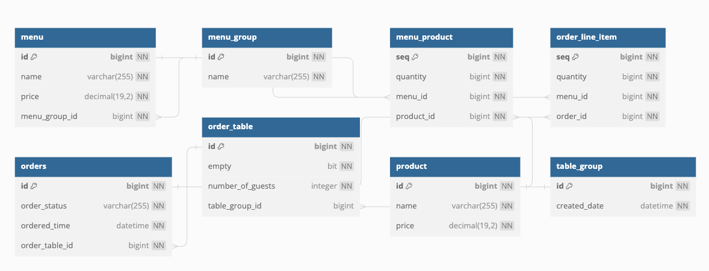

# 키친포스

## 요구 사항

### 메뉴

- 메뉴 가격은 0 미만일 수 없다.
- 메뉴는 하나의 메뉴 그룹에 포함된다.
- 메뉴는 다수의 메뉴 상품을 포함한다.
    - 메뉴는 메뉴 상품을 생성할 책임을 갖는다.
- 메뉴의 가격은 메뉴 상품의 총 가격을 초과할 수 없다.

---

- 메뉴 전체를 조회한다.
    - 메뉴 전체를 조회한다.
    - 메뉴 각각의 메뉴 상품을 조회한다.
    - 메뉴 각각의 메뉴 상품을 설정한다.
    - 메뉴 전체 목록을 반환한다.

- 메뉴를 생성한다.
    - 메뉴의 가격이 0 미만일 경우 예외를 던진다.
    - 존재하지 않는 메뉴 그룹에 포함될 경우 예외를 던진다.
    - 존재하지 않는 메뉴 상품을 포함할 경우 예외를 던진다.
    - 메뉴의 가격이 메뉴 상품의 총가격을 초과할 경우 예외를 던진다.
    - 메뉴를 저장한다.
    - 메뉴 상품을 저장한다.
    - 저장된 메뉴를 반환한다.

---

### 메뉴 상품

- 메뉴 상품은 메뉴를 포함한다.
- 메뉴 상품은 상품을 포함한다.
- 메뉴 상품은 개수를 갖는다.
    - 메뉴 상품의 개수는 0이 될 수 있다.

---

### 메뉴 그룹

- 메뉴 그룹은 이름을 갖는다.

---

- 메뉴 그룹을 생성한다.

- 전체 메뉴 그룹을 조회한다.

---

### 주문

- 주문은 하나의 주문 테이블에 포함된다.
- 주문은 다수의 주문 항목을 포함한다.
- 주문은 주문 상태를 갖는다.
- 주문 항목이 없는 주문은 존재할 수 없다.
- 존재하지 않는 메뉴를 주문 항목에 포함할 수 없다.
- 존재하지 않는 주문 테이블을 포함할 수 없다.
- 주문 테이블이 비었다면 주문할 수 없다.
-

---

- 주문 전체를 조회한다.
    - 주문 전체를 조회한다.
    - 주문 각각의 주문 항목을 조회한다.
    - 주문 각각의 주문 항목을 설정한다.
    - 주문 전체 목록을 반환한다.

- 주문 상태를 변경한다.
    - 존재하지 않는 주문의 상태를 변경할 경우 예외를 던진다.
    - **계산 완료**된 주문의 상태를 변경할 경우 예외를 던진다.
    - 주문 상태를 변경하고 저장한다.
    - 상태가 변경된 주문을 반환한다.

- 주문을 생성한다.
    - 주문 항목이 없을 경우 예외를 던진다.
    - 주문 항목 개수와 메뉴 개수가 다를 경우 예외를 던진다.
    - 존재하지 않는 주문 테이블로 주문을 생성할 경우 예외를 던진다.
    - 주문 테이블이 비었을 경우 예외를 던진다.
    - 주문 테이블을 설정한다.
    - 주문 상태를 **조리**로 설정한다.
    - 주문 시각을 현재 시각으로 설정한다.
    - 주문을 저장한다.
    - 각각의 주문 항목을 저장한다.
    - 각각의 주문 항목을 설정한다.
    - 저장된 주문을 반환한다.

### 주문 항목

- 주문 항목은 주문에 포함된다.
- 주문 항목은 메뉴를 갖는다.
- 주문 항목은 개수를 갖는다.

---

### 주문 테이블

- 주문 테이블은 단체 지정을 포함한다.
- 주문 테이블은 방문한 손님 수를 갖는다.
- 주문 테이블은 비었는지 여부를 갖는다.
- 단체 지정이 있는 주문테이블은 빈 테이블로 변경할 수 없다.
- **조리** 혹은 **식사** 상태인 주문이 있는 주문 테이블은 빈 테이블로 변경할 수 없다.
- 빈 주문 테이블은 손님 수를 변경할 수 없다.

---

- 주문 테이블을 생성한다.
    - 주문 테이블을 저장한다.
    - 저장한 주문 테이블을 반환한다.

- 전체 주문 테이블을 조회한다.

- 주문 테이블이 비었는지 여부를 변경한다.
    - 존재하지 않는 주문 테이블일 경우 예외를 던진다.
    - 주문 테이블의 단체 지정이 존재할 경우 예외를 던진다.
    - 주문 테이블에 **조리** 혹은 **식사** 상태인 주문이 있는 경우 예외를 던진다.
    - 주문 테이블을 비었다고 설정한다.
    - 주문 테이블을 저장한다.
    - 저장한 주문 테이블을 반환한다.

- 주문 테이블에 방문한 손님 수를 변경한다.
    - 방문한 손님 수가 0 미만일 경우 예외를 던진다.
    - 존재하지 않는 주문 테이블일 경우 예외를 던진다.
    - 주문 테이블이 비었을 경우 예외를 던진다.
    - 주문 테이블의 방문한 손님 수를 변경한다.
    - 주문 테이블을 저장한다.
    - 저장한 주문 테이블을 반환한다.

---

### 주문 상태

- 주문 상태는 **조리**, **식사**, **계산 완료** 로 분류된다.

---

### 상품

- 상품은 이름을 갖는다.
- 상품은 가격을 갖는다.
    - 상품 가격은 0 미만일 수 없다.

---

- 전체 상품을 조회한다

- 상품을 생성한다.
    - 상품 가격이 0 미만이면 예외를 던진다.
    - 상품을 저장한다.
    - 상품을 반환한다.

---

### 단체 지정

- 단체 지정은 생성 시각을 갖는다.
- 단체 지정은 다수의 주문 테이블을 포함한다.
- 단체 지정의 주문 테이블 개수는 2개 이상이어야 한다.
- 존재하지 않는 주문 테이블을 포함할 수 없다.

---

- 단체 지정을 생성한다.
    - 주문 테이블 목록이 2 미만일 경우 예외를 던진다.
    - 주문 테이블 목록의 개수가 저장된 주문 테이블 목록과 다를 경우 예외를 던진다.
    - 주문 테이블이 비어있지 않거나 단체 지정을 가질 경우 예외를 던진다.
    - 단체 지정의 생성 시각을 설정한다.
    - 단체 지정을 저장한다.
    - 각 주문 테이블의 단체 지정을 설정한다.
    - 각 주문 테이블이 비어있지 않다고 설정한다.
    - 단체 지정에 주문 테이블을 설정한다.
    - 저장된 단체 지정을 반환한다.

- 단체 지정을 제거한다.
    - 단체 지정으로 주문 테이블 목록을 조회한다.
    - 주문 테이블 중 주문 상태가 **조리** 혹은 **식사** 주문 테이블이 있을 경우 예외를 던진다.
    - 각 주문 테이블의 단체 지정을 해제한다.
    - 각 주문 테이블이 비어있지 않다고 설정한다. `버그?`
    - 각 주문 테이블을 저장한다.

## 용어 사전

|   한글명    |       영문명        | 설명                            |
|:--------:|:----------------:|:------------------------------|
|    상품    |     product      | 메뉴를 관리하는 기준이 되는 데이터           |
|  메뉴 그룹   |    menu group    | 메뉴 묶음, 분류                     |
|    메뉴    |       menu       | 메뉴 그룹에 속하는 실제 주문 가능 단위        |
|  메뉴 상품   |   menu product   | 메뉴에 속하는 수량이 있는 상품             |
|    금액    |      amount      | 가격 * 수량                       |
|  주문 테이블  |   order table    | 매장에서 주문이 발생하는 영역              |
|  빈 테이블   |   empty table    | 주문을 등록할 수 없는 주문 테이블           |
|    주문    |      order       | 매장에서 발생하는 주문                  |
|  주문 상태   |   order status   | 주문은 조리 ➜ 식사 ➜ 계산 완료 순서로 진행된다. |
| 방문한 손님 수 | number of guests | 필수 사항은 아니며 주문은 0명으로 등록할 수 있다. |
|  단체 지정   |   table group    | 통합 계산을 위해 개별 주문 테이블을 그룹화하는 기능 |
|  주문 항목   | order line item  | 주문에 속하는 수량이 있는 메뉴             |
|  매장 식사   |      eat in      | 포장하지 않고 매장에서 식사하는 것           |

## DB diagram

## 리팩터링

### step1 - 테스트를 통한 코드 보호

- [x] 도메인 파악
    - [x] DB 구조도
    - [x] 기능 요구사항 정리

- [x] 테스트 코드 작성
    - [x] Dao 테스트 작성
    - [x] Service 테스트 작성

### step2 - 서비스 리팩터링

- [x] 객체 책임 부여
    - [x] 생성 책임
    - [x] 비즈니스 로직 수행 책임

- [x] 비즈니스 로직과 서비스 로직 분리

- [x] setter 메서드 제거

- [x] Repository 도입

### step3 - 의존성 리팩터링

- [x] 도메인별 패키지 분리

- [x] 도메인별 의존성 단방향 설정

- [x] 메뉴 정보가 변경되더라도 주문 항목이 변경되지 않게 구현
