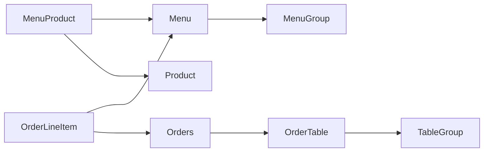

# 키친포스

## 요구 사항

## 상품 (Product)

### 상품 등록

- 상품을 등록한다.
- 상품 가격은 null 이거나 음수일 경우 예외가 발생한다.

### 상품 조회

- 모든 상품 목록을 조회한다.

## 메뉴 그룹 (MenuGroup)

### 메뉴 그룹 등록

- 메뉴 그룹을 등록한다.
- 
### 메뉴 그룹 조회

- 전체 메뉴 그룹 목록을 조회한다.

## 메뉴 (Menu)

### 메뉴 등록

#### 메뉴 가격

- 메뉴는 메뉴 상품 목록의 가격 총합보다 가격이 적어야 한다.
- 메뉴는 가격이 음이 아닌 정수로 존재해야 한다.

#### 메뉴 - 메뉴 그룹

- 메뉴는 속할 메뉴 그룹이 존재해야 한다.

#### 메뉴 - 메뉴 상품

- 메뉴는 등록할 메뉴 상품이 비어있을 수 있다.
- 메뉴에 등록할 메뉴 상품이 존재할 경우 상품은 등록되어 있어야 한다.

## 주문 테이블 (OrderTable)

### 주문 테이블 등록

- 주문 테이블 등록한다.

### 주문 테이블 조회

- 모든 주문 테이블을 조회한다.

### 주문 테이블 수정

- 주문 테이블을 비운다.
  - 
 

## 용어 사전

| 한글명 | 영문명 | 설명 |
| --- | --- | --- |
| 상품 | product | 메뉴를 관리하는 기준이 되는 데이터 |
| 메뉴 그룹 | menu group | 메뉴 묶음, 분류 |
| 메뉴 | menu | 메뉴 그룹에 속하는 실제 주문 가능 단위 |
| 메뉴 상품 | menu product | 메뉴에 속하는 수량이 있는 상품 |
| 금액 | amount | 가격 * 수량 |
| 주문 테이블 | order table | 매장에서 주문이 발생하는 영역 |
| 빈 테이블 | empty table | 주문을 등록할 수 없는 주문 테이블 |
| 주문 | order | 매장에서 발생하는 주문 |
| 주문 상태 | order status | 주문은 조리 ➜ 식사 ➜ 계산 완료 순서로 진행된다. |
| 방문한 손님 수 | number of guests | 필수 사항은 아니며 주문은 0명으로 등록할 수 있다. |
| 단체 지정 | table group | 통합 계산을 위해 개별 주문 테이블을 그룹화하는 기능 |
| 주문 항목 | order line item | 주문에 속하는 수량이 있는 메뉴 |
| 매장 식사 | eat in | 포장하지 않고 매장에서 식사하는 것 |
