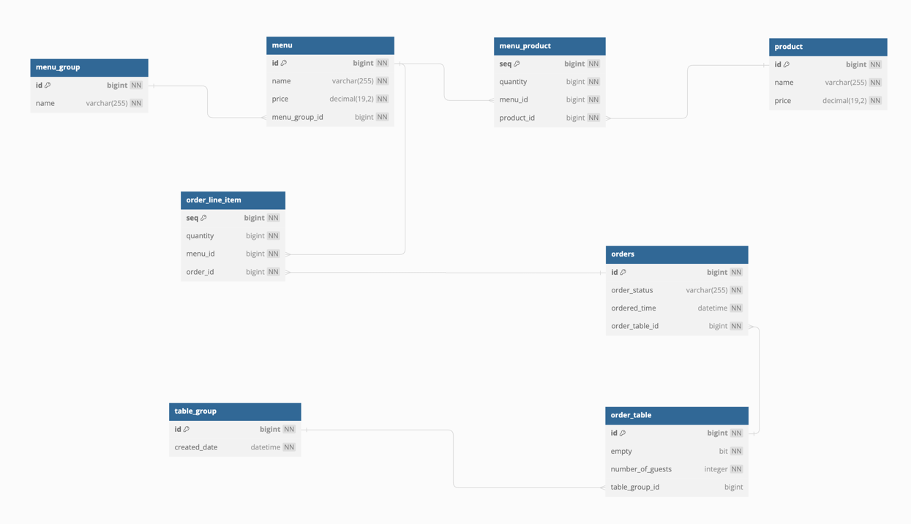
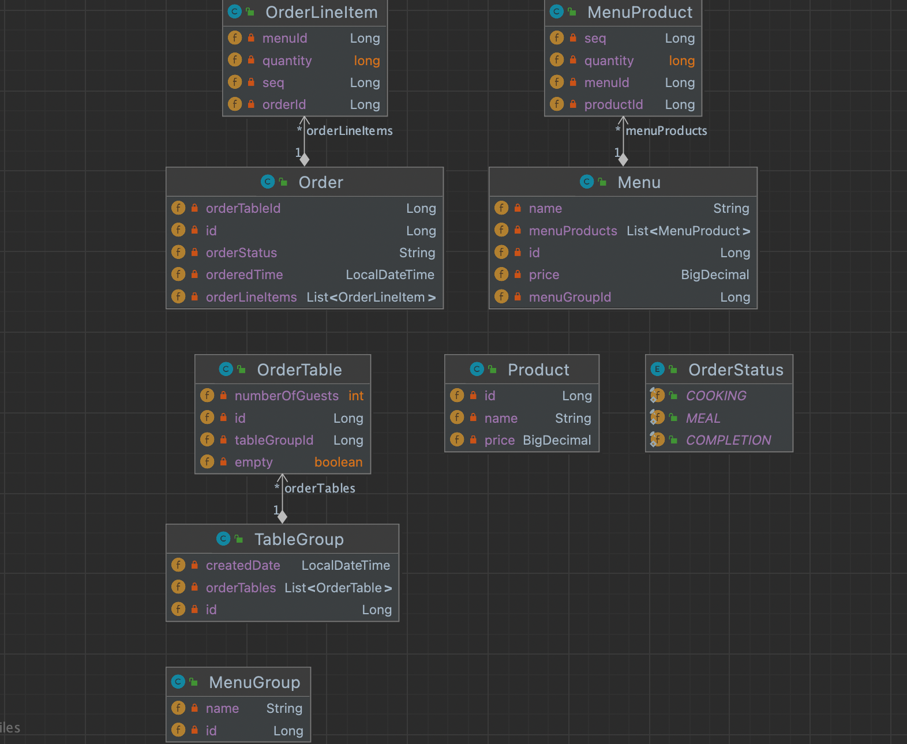

# 키친포스

## 요구 사항

[ ] 리팩토링을 위한 테스트 코드를 작성한다

### 상품

* 상품을 등록할 수 있다.
* 상품의 가격이 올바르지 않으면 등록할 수 없다.
    * 상품의 가격은 0원 이상이어야 한다.
* 상품의 목록을 조회할 수 있다.

### 메뉴

* 메뉴를 등록할 수 있다.
* 메뉴의 가격이 올바르지 않으면 등록할 수 없다.
    * 메뉴의 가격은 0원 이상이어야 한다.
    * 메뉴 상품들의 가격의 합과 메뉴의 가격은 같거나 작아야 한다.
* 하나의 메뉴는 반드시 하나의 메뉴 그룹에 속해야 해야 등록할 수 있다.
* 메뉴의 목록을 조회할 수 있다.

### 메뉴 상품

* 메뉴를 등록할 시, 등록되어야 한다.
* 메뉴 상품이 포함된 메뉴의 ID가 반드시 매핑되어야 한다.
* 메뉴 상품에 대응되는 상품 ID가 반드시 매핑되어야 한다.

### 메뉴 그룹

* 메뉴 그룹을 등록할 수 있다.
* 메뉴 그룹의 목록을 조회할 수 있다.

### 주문

* 주문을 등록할 수 있다.
* 주문 항목이 올바르지 않으면 등록할 수 없다.
    * 주문은 반드시 주문 항목이 있어야 한다.
    * 주문 항목의 갯수와 주문 메뉴의 수량이 같아야 한다.
* 주문 테이블이 올바르지 않으면 등록할 수 없다.
    * 주문은 대응되는 주문 테이블이 반드시 존재해야 한다.
* 주문의 초기 상태는 `COOKING` 상태여야 한다.
* 주문은 등록 시간을 포함하고 있어야 한다.
* 주문은 대응되는 주문 테이블의 ID가 반드시 매핑되어야 한다.
* 주문의 목록을 조회할 수 있다.
* 주문의 주문 상태를 바꿀 수 있어야 한다.
    * 단, `COMPLETION` 상태에서는 주문 상태를 바꿀 수 없다.

### 주문 항목
* 주문을 등록할 시, 등록되어야 한다.
* 주문 항목이 포함된 주문의 ID가 반드시 매핑되어야 한다.
* 주문 항목에 대응되는 메뉴 ID가 반드시 매핑되어야 한다.

### 주문 테이블
* 주문 테이블을 등록할 수 있다
    * 초기에는 대응되는 주문 ID와 단체 테이블 ID가 없어야 한다.
* 주문 테이블의 목록을 조회할 수 있어야 한다.
* 주문 테이블의 이용가능상태를 바꿀 수 있어야 한다.
    * 단, 이미 다른 단체 테이블에 속하면 바뀔 수 없다.
    * 단, 해당 테이블에서 진행 중인 주문(주문 상태가 `COOKING`이거나 `MEAL`인 경우)이 있다면 바꿀 수 없다.
* 주문 테이블이 정상적이지 않다면 주문 테이블의 손님 수를 변경할 수 없다.
    * 주문 테이블이 존재하지 않는 경우
    * 주문 테이블의 손님 수가 음수인 경우
* 단체로 지정된 테이블의 경우 대응되는 단체 ID가 반드시 매핑되어야 한다.
* 단체로 지정되거나 단체에서 지정이 해제된 테이블의 경우 점유 상태를 바꾸어야 한다.
* 단체에서 지정이 해제된 테이블의 경우 대응되는 단체 ID를 더이상 매핑해서는 안된다.

### 단체 지정
* 다음과 같은 경우는 단체 지정을 할 수 없다.
    * 단체 지정을 원하는 테이블의 갯수가 2개 미만인 경우
    * 실제 저장된 테이블 수와 단체 지정을 원하는 테이블의 갯수가 다른 경우
    * 단체 지정을 원하는 테이블이 이미 다른 단체에 속하는 경우
    * 단체 지정을 원하는 테이블이 이미 점유 중인 경우
* 단체 지정은 등록 시간을 포함하고 있어야 한다.
* 다음과 같은 경우는 단체 지정을 해제할 수 없다.
    * 단체로 지정된 테이블에서 진행 중인 주문(주문 상태가 `COOKING`이거나 `MEAL`인 경우)이 있는 경우

## DB 구조

## 쿨래스 다이어그램

## 용어 사전

| 한글명 | 영문명 | 설명 |
| --- | --- | --- |
| 상품 | product | 메뉴를 관리하는 기준이 되는 데이터 |
| 메뉴 그룹 | menu group | 메뉴 묶음, 분류 |
| 메뉴 | menu | 메뉴 그룹에 속하는 실제 주문 가능 단위 |
| 메뉴 상품 | menu product | 메뉴에 속하는 수량이 있는 상품 |
| 금액 | amount | 가격 * 수량 |
| 주문 테이블 | order table | 매장에서 주문이 발생하는 영역 |
| 빈 테이블 | empty table | 주문을 등록할 수 없는 주문 테이블 |
| 주문 | order | 매장에서 발생하는 주문 |
| 주문 상태 | order status | 주문은 조리 ➜ 식사 ➜ 계산 완료 순서로 진행된다. |
| 방문한 손님 수 | number of guests | 필수 사항은 아니며 주문은 0명으로 등록할 수 있다. |
| 단체 지정 | table group | 통합 계산을 위해 개별 주문 테이블을 그룹화하는 기능 |
| 주문 항목 | order line item | 주문에 속하는 수량이 있는 메뉴 |
| 매장 식사 | eat in | 포장하지 않고 매장에서 식사하는 것 |
