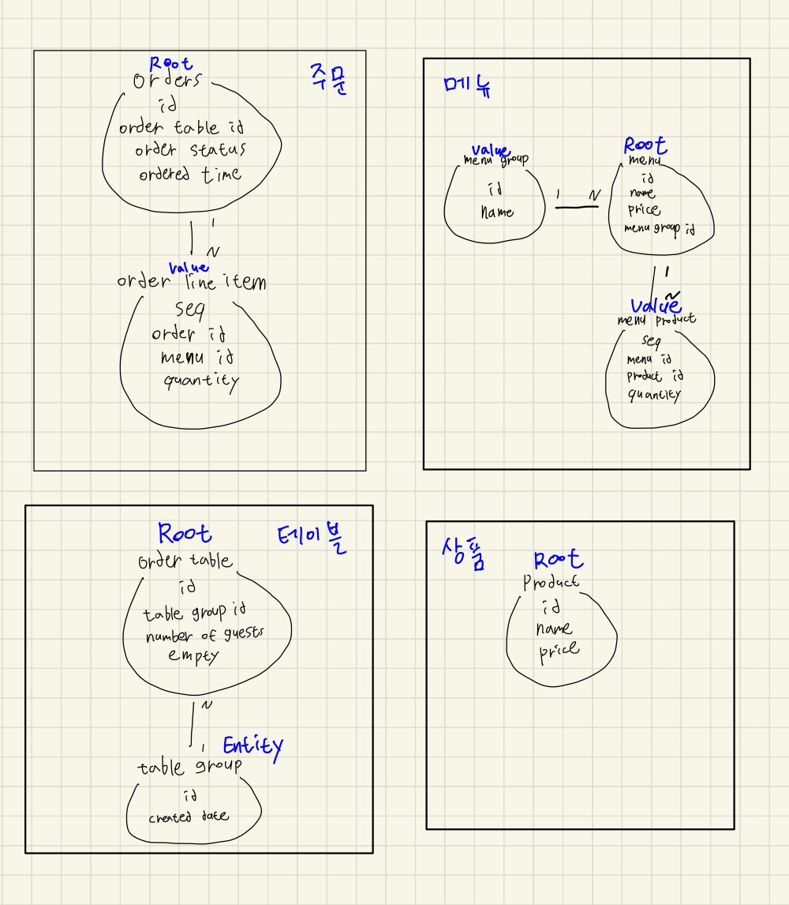

# 키친포스

## 요구 사항 - 테스트 여부 체크

### 상품
- [x] 상품의 가격은 null이거나 0보다 작은 값일 수 없다.
- [x] 상품 이름은 null일 수 없다.

### 테이블
- [ ] 테이블은 그룹으로 묶일 수 있다.
- [ ] 테이블 그룹에 속한 테이블은 빈 테이블이 될 수 없다.
- [ ] 테이블이 두개 이하인 테이블 그룹은 있을 수 없다.
- [ ] 조리 상태나 식사 상태인 테이블은 빈 테이블이 될 수 없다.
- [ ] 테이블 손님의 수는 0보다 작을 수 없다.
- [ ] 빈 테이블의 손님 수를 변경할 수 없다.

### 메뉴
- [x] 메뉴의 이름은 null일 수 없다.
- [x] 메뉴의 가격은 null이거나 0보다 작은 값일 수 없다.
- [x] 등록되는 메뉴는 메뉴 그룹에 반드시 포함되어야 한다.
- [x] 메뉴를 등록할 때 메뉴에 포함되는 메뉴상품은 모두 상품목록에 존재해야한다.
- [x] 메뉴의 가격은 메뉴 상품의 가격 합보다 더 클 수 없다.
- [x] 메뉴가 등록될 때 메뉴 상품도 같이 등록한다.

### 주문
- [ ] 주문 항목 없는 주문은 있을 수 없다.
- [ ] 존재하지 않는 메뉴는 주문할 수 없다.
- [ ] 존재하지 않는 테이블에선 주문할 수 없다.
- [ ] 주문을 시작하면 주문은 조리 상태가 된다.
- [ ] 주문을 등록할 때 주문 항목 정보를 같이 등록한다.

## 용어 사전

| 한글명 | 영문명 | 설명 |
| --- | --- | --- |
| 상품 | product | 메뉴를 관리하는 기준이 되는 데이터 |
| 메뉴 그룹 | menu group | 메뉴 묶음, 분류 |
| 메뉴 | menu | 메뉴 그룹에 속하는 실제 주문 가능 단위 |
| 메뉴 상품 | menu product | 메뉴에 속하는 수량이 있는 상품 |
| 금액 | amount | 가격 * 수량 |
| 주문 테이블 | order table | 매장에서 주문이 발생하는 영역 |
| 빈 테이블 | empty table | 주문을 등록할 수 없는 주문 테이블 |
| 주문 | order | 매장에서 발생하는 주문 |
| 주문 상태 | order status | 주문은 조리 ➜ 식사 ➜ 계산 완료 순서로 진행된다. |
| 방문한 손님 수 | number of guests | 필수 사항은 아니며 주문은 0명으로 등록할 수 있다. |
| 단체 지정 | table group | 통합 계산을 위해 개별 주문 테이블을 그룹화하는 기능 |
| 주문 항목 | order line item | 주문에 속하는 수량이 있는 메뉴 |
| 매장 식사 | eat in | 포장하지 않고 매장에서 식사하는 것 |

## 도메인 관계도

