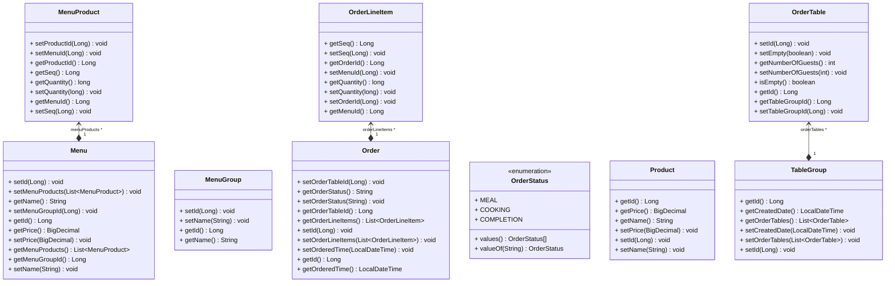

# 키친포스

## 미션 요구 사항
1. `kitchenpos` 패키지의 코드를 보고 키친포스의 요구사항을 `README.md`에 작성.
2. 모든 Business Object에 대한 테스트 코드 작성.

## 키친포스 요구 사항
#### 메뉴
- [x] 메뉴를 등록할 수 있다.
  - [x] 메뉴의 가격이 null이거나 음수 일 수 없다.
  - [x] 메뉴의 메뉴 그룹이 등록되어 있어야 한다.
  - [x] 메뉴의 메뉴 상품들의 상품이 등록되어 있어야 한다.
  - [x] 메뉴의 가격이 메뉴 상품들의 가격 합보다 크면 안된다.
- [x] 등록된 메뉴를 조회할 수 있다.
#### 메뉴 그룹
- [x] 메뉴 그룹을 등록할 수 있다.
- [x] 등록된 메뉴 그룹을 조회할 수 있다.
#### 상품
- [x] 상품을 등록할 수 있다.
  - [x] 상품의 가격이 null이거나 0일 수 없다.
- [x] 등록된 상품을 조회할 수 있다.
#### 테이블
- [x] 주문 테이블을 추가할 수 있다.
- [x] 등록된 테이블을 조회할 수 있다.
- [ ] 특정 주문 테이블을 빈 테이블로 수정할 수 있다.
  - [ ] 특정 주문 테이블이 존재해야 한다.
  - [ ] 특정 주문이 속한 테이블 그룹이 Null이면 안된다.
  - [ ] 주문 테이블의 주문 상태가 조리나 식사 상태면 안된다.
- [x] 특정 주문 테이블의 방문한 손님 수를 수정할 수 있다.
  - [x] 수정하려는 방문 손님 수가 0보다 작을 수 없다.
  - [x] 특정 주문 테이블이 존재해야 한다.
  - [x] 특정 주문 테이블이 비어있으면 안된다.
#### 테이블 그룹
- [x] 테이블 그룹을 등록할 수 있다.
  - [x] 그룹화하려는 주문 테이블이 2개 미만일 수 없다.
  - [x] 그룹화하려는 주문 테이블이 모두 등록되어 있어야 한다.
  - [x] 그룹화하려는 주문 테이블이 비어있지 않거나 이미 테이블 그룹에 속해있으면 안된다.
- [ ] 테이블 그룹을 해제할 수 있다.
  - [ ] 해제하려는 그룹에 속한 주문 테이블이 조리나 식사 상태일 수 없다. 
#### 주문
- [x] 주문을 등록할 수 있다.
  - [x] 주문항목이 0개이면 안된다.
  - [x] 주문 항목에 해당하는 메뉴들이 모두 등록되어 있어야 한다.
  - [x] 주문 항목이 중복되는 메뉴를 가지면 안된다.
  - [x] 등록하려는 주문의 주문 테이블이 존재해야 한다.
  - [x] 주문 테이블이 비어있으면 안된다.
- [x] 등록된 주문을 조회할 수 있다.
- [x] 특정 주문의 상태를 변경할 수 있다.
  - [x] 특정 주문이 등록되어 있어야 한다.
  - [x] 특정 주문의 상태가 계산 완료면 안된다.

## 클래스 다이어그램

## 용어 사전

| 한글명 | 영문명 | 설명 |
| --- | --- | --- |
| 상품 | product | 메뉴를 관리하는 기준이 되는 데이터 |
| 메뉴 그룹 | menu group | 메뉴 묶음, 분류 |
| 메뉴 | menu | 메뉴 그룹에 속하는 실제 주문 가능 단위 |
| 메뉴 상품 | menu product | 메뉴에 속하는 수량이 있는 상품 |
| 금액 | amount | 가격 * 수량 |
| 주문 테이블 | order table | 매장에서 주문이 발생하는 영역 |
| 빈 테이블 | empty table | 주문을 등록할 수 없는 주문 테이블 |
| 주문 | order | 매장에서 발생하는 주문 |
| 주문 상태 | order status | 주문은 조리 ➜ 식사 ➜ 계산 완료 순서로 진행된다. |
| 방문한 손님 수 | number of guests | 필수 사항은 아니며 주문은 0명으로 등록할 수 있다. |
| 단체 지정 | table group | 통합 계산을 위해 개별 주문 테이블을 그룹화하는 기능 |
| 주문 항목 | order line item | 주문에 속하는 수량이 있는 메뉴 |
| 매장 식사 | eat in | 포장하지 않고 매장에서 식사하는 것 |
