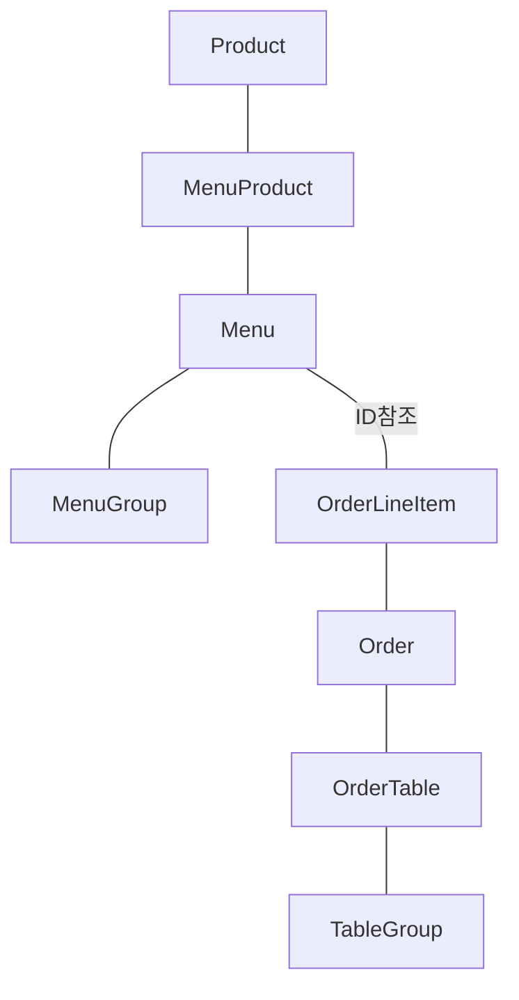
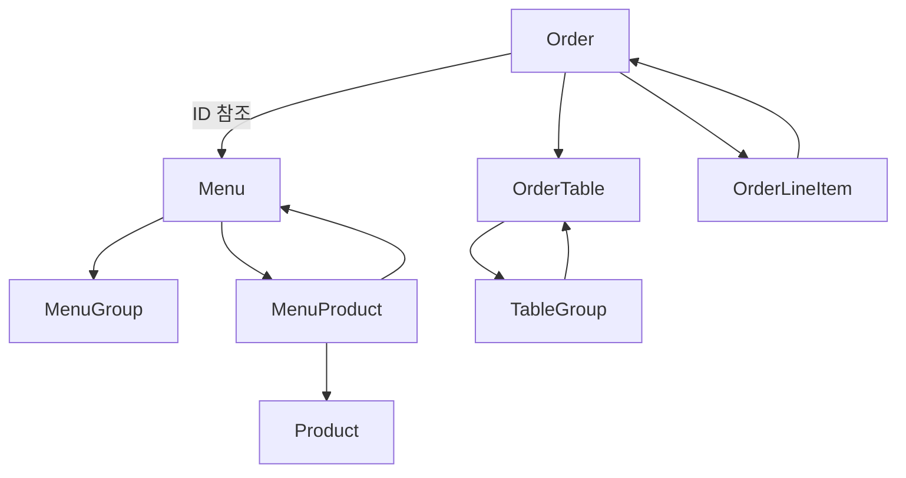
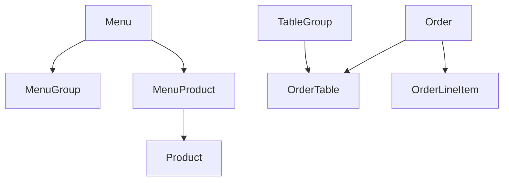

# 키친포스

## 용어 사전

| 한글명 | 영문명 | 설명 |
| --- | --- | --- |
| 상품 | product | 메뉴를 관리하는 기준이 되는 데이터 |
| 메뉴 그룹 | menu group | 메뉴 묶음, 분류 |
| 메뉴 | menu | 메뉴 그룹에 속하는 실제 주문 가능 단위 |
| 메뉴 상품 | menu product | 메뉴에 속하는 수량이 있는 상품 |
| 금액 | amount | 가격 * 수량 |
| 주문 테이블 | order table | 매장에서 주문이 발생하는 영역 |
| 빈 테이블 | empty table | 주문을 등록할 수 없는 주문 테이블 |
| 주문 | order | 매장에서 발생하는 주문 |
| 주문 상태 | order status | 주문은 조리 ➜ 식사 ➜ 계산 완료 순서로 진행된다. |
| 방문한 손님 수 | number of guests | 필수 사항은 아니며 주문은 0명으로 등록할 수 있다. |
| 단체 지정 | table group | 통합 계산을 위해 개별 주문 테이블을 그룹화하는 기능 |
| 주문 항목 | order line item | 주문에 속하는 수량이 있는 메뉴 |
| 매장 식사 | eat in | 포장하지 않고 매장에서 식사하는 것 |

## 관계 다이어그램

### 현재 의존 관계

### 생성/변경 시 필요한 의존 관계

- 주문을 하기 이전에 주문 테이블의 상태를 먼저 변경해야한다.
- 테이블 그룹을 생성 하기 이전에 주문 테이블이 먼저 있어야한다.

위의 정보들을 토대로 판단해보았을 때 다음과 같은 결론을 낼 수 있다.
- 생성 주기별로 객체의 군집을 분류했을 때
  - Product
  - Menu, MenuProduct
  - MenuGroup
  - Order, OrderLineItem
  - OrderTable
  - TableGroup

위의 6가지로 군집을 분류할 수 있다.

하지만 다음과 같은 이유로 Order, OrderLineItem, OrderTable, TableGroup을 하나의 군집으로 묶어볼 수 있다.
- Order를 생성할 때에는 매핑되어있는 OrderTable이 빈 테이블이면 안된다(다른 테이블의 주문이 들어오면 안된다.)는 점
- TableGroup을 생성할 때에는 OrderTable이 빈 테이블이어야하고, 다른 TableGroup에 연결되어있으면 안된다는 점

따라서 아래와 같이 군집을 따로 분류하고 이들 간 의존성 또한 분리해보고자 한다.
### 1. 상품
- Product

### 2. 메뉴
- Menu, MenuProduct

### 3. 메뉴 그룹
- MenuGroup

### 4. 주문
- Order, OrderLineItem, OrderTable, TableGroup
