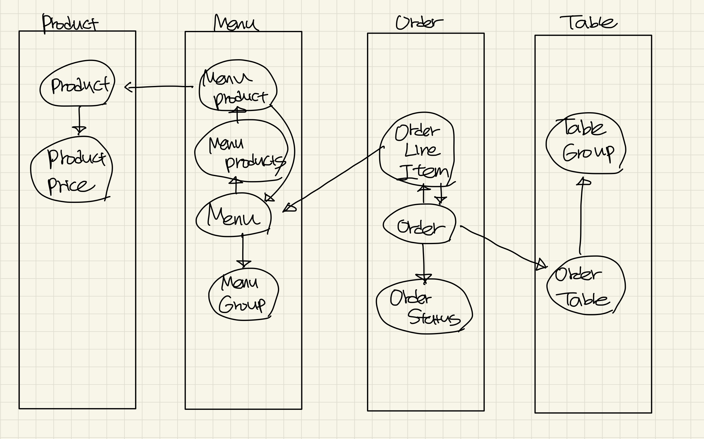

# 키친 포스 리팩터링 3단계

## 요구사항

- 메뉴의 이름과 가격이 변경되면 주문 항목도 함께 변경된다. 메뉴 정보가 변경되더라도 주문 항목이 변경되지 않게 구현한다.
- 클래스 간의 방향도 중요하고 패키지 간의 방향도 중요하다. 클래스 사이, 패키지 사이의 의존 관계는 단방향이 되도록 해야 한다.

1. 도메인별 패키지 분리

   - Product
   - Menu
   - Table
   - Order 

   4가지 그룹으로 구성, 일단 이름이 같아보이는 것으로 맞췄다. TableGroup과 Table의 생성주기가 다르고, MenuGroup과 Menu의 생성주기도 달라서 패키지를 분리하는게 맞나 고민중이다.

2. 현재 의존성 방향이 어떻게 흐르고 있는지 확인해보자

<도메인 구조>

OneToMany 단방향으로 걸고 싶었지만, 시간이 부족하고 insert후 update가 나가지 않는 이상한 문제를 겪게되어 양방향 매핑으로 걸어주게됐다. Menu - MenuProduct, Order-OrderLineItem이 서로를 양방향으로 참조하는 구조가 발생한다. 하지만 각 쌍의 생성주기가 같기 때문에 크게 문제가 안될 것 같다는 생각이다.

<서비스, Repository 구조>

패키지 사이의 의존관계가 양방향으로 존재하지 않았는데, 이게 Validator를 미리 구현해서 그런건가? Repository에서 Service를 참조하고 있지 않고 Service는 Repository들을 참조하고 있으니 의존관계가 단방향이 안될수가 있나 고민이 된다.

크리스: Order를 생성할 때 TableRepository를 봐야하고, Table을 생성할 때 OrderRepository를 봐야하니 양방향이 걸리는 것이다.

2단계를 진행할 떄 Validator를 구현해놓은 덕에 의존성의 방향은 단방향으로 구현된 것 같다.

3. Menu의 가격과 이름이 변하더라도, Order에서 갖고있는 menu의 정보가 변하면 안된다는 요구사항 반영

   ddl을 수정한다. -> OrderLineItem이 menuId가 아니라 menuName과 menuPrice를 갖고있도록 변경한다.

   Order에 OrderLineItem을 주입하기전에 MenuRepository에서 조회한 값을 넣어준다.

   	- 고민 사항: findById에서 하나씩하는 것보다 findAllById하는것이 빠른건가? Map에 집어넣어두고 하나씩 빼서 쓰는게 맞을까?

   

