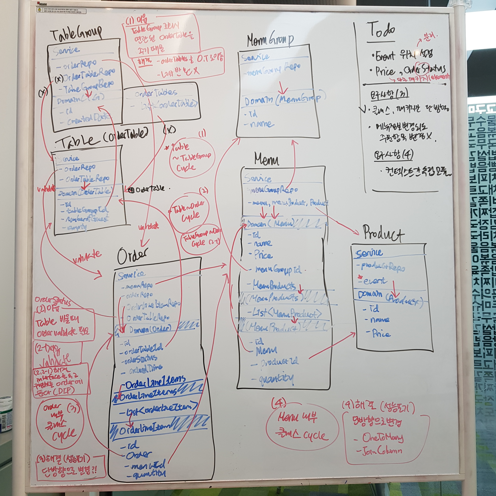

# step4 

- [x] service에서 dto로 반환하도록 변경
- [x] 패키지 분리
---
### 의존성 그래프 작성

---
### 패키지 분리
- [x] Price: element 패키지를 만들어 분리
- [x] Event
  - Product 패키지로 이동
  - handle repository에 따라 분리

### 패키지간 단방향 설정
- [x] TableGroup 리스트 반환 제거하는 방향으로 수정
- [x] OrderStatus validate 로직 DI 방식으로 의존성 역전 설정
  - TableGroup
  - Table(OrderTable)

### 클래스간 단방향 설정
- [x] Order. List<OrderLineItem> -> OneToMany 단방향 설정
- [x] Menu. List<MenuProduct> -> OneToMany 단방향 설정
---
- [ ] step3에서 order과 menu 사이의 관계 미션 구현
- [ ] 멀티모듈 내용 프로젝트에 적용(step4)
